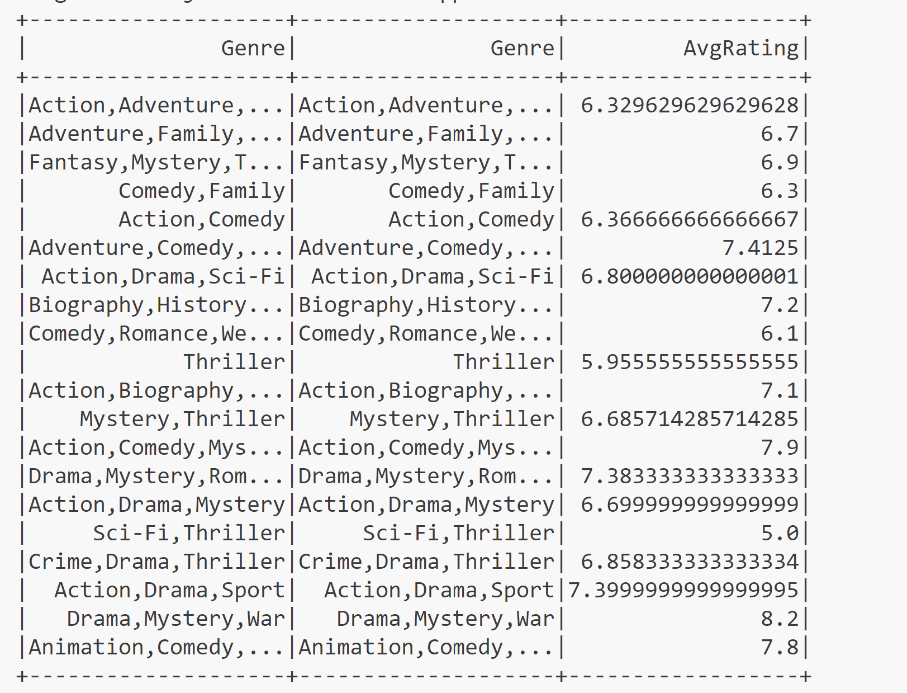

# Week10-miniProj-zg105

This script is designed to perform an ETL process on IMDB movie data, followed by a query operation to calculate the average rating per genre. It uses Apache Spark to handle data extraction, processing, and querying.

## Prerequisites

- Python 3.6 or higher.
- Apache Spark installed and properly configured.
- The necessary Python packages installed (pyspark, etc.).

## Features

The script does the following:

- Extracts the IMDB movie data from a CSV file hosted on GitHub.
- Loads the data into a Spark DataFrame with a specified schema.
- Transforms the data to calculate the average rating of movies per genre.
- Displays the results in the console.
- Creates a temporary view of the movie data for additional SQL operations if needed.

## Result
